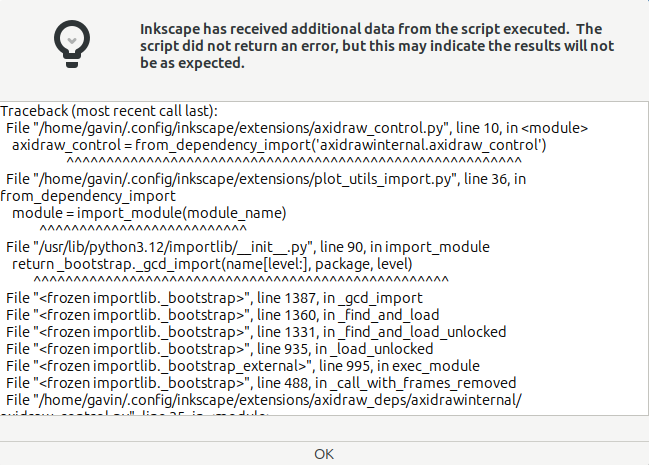
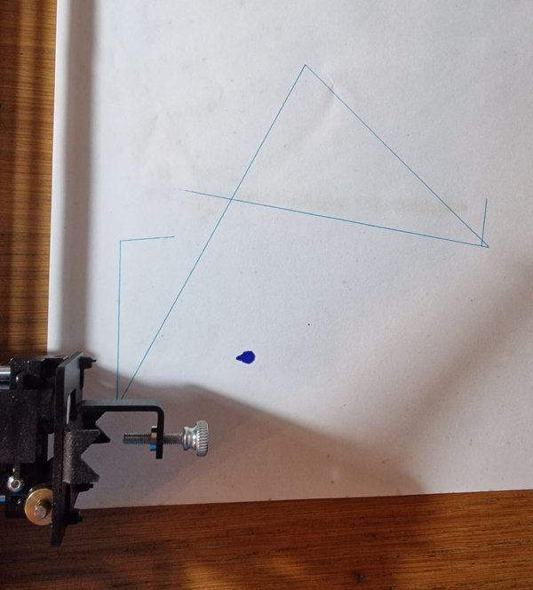
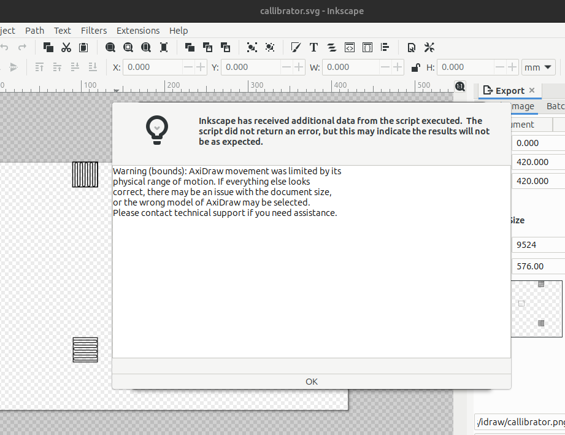

# Inkscape Extension for iDraw v1 on Python 3.12

### What am I trying to do?

Connect my iDraw v1 plotter to my laptop so that I can plot computer-generated SVGs.

### Problem statement

The Axidraw Inkscape Extension has been broken since upgrading my laptop to Ubuntu 24.04.1 LTS (noble) was released. The Axidraw Extension is actively used by a community of pen plotter owners.  Surprisingly, it has been difficult to find other users with the same issue. The error message thrown from Inkscape was `ModuleNotFoundError: No module named 'urllib3.packages.six.moves'`.



However, the reason seems to be deeper than a missing module. The Axidraw developers have bundled all the dependencies to isolate themselves from external changes. In Python 3.12, however, there was a breaking change as distutils was removed. I reckon the culprit for the problem comes from [PEP 632](https://peps.python.org/pep-0632/). 

### How to fix it - the Uunatek option

My iDraw plotter was provided by Uunatek. The exact version of their Inkscape Extension is unknown but the source is a zipfile (extensions-240107.zip) distributed via Google Drive by Uunatek on their 
[Download page](https://uunatek.com/pages/downloads). Rather than start from this copy of the Inkscape Extension I thought it might be easier to go back and build from the latest source.

There would be one issue, which is that assuming I got it to build on Python 3.12 then I would have to apply the changes described in this [Uunatek video](https://www.youtube.com/watch?v=uLNCTl9n0Ao). Let's come back to that later.


### Starting over - the Axidraw option

This fork is from AxiDraw Software 3.9.0 released on May 24, 2023. The above changes are made on the dev branch.

```
$ git clone https://github.com/snow6oy/axidraw.git
$ git checkout dev
```

The Axidraw Extension has different builds for Windows, Mac and so on. When I ran `bash buildink.sh` it failed with hundreds of lines of output. The last line is shown below.

```
ERROR: Could not build wheels for pyclipper, which is required to install pyproject.toml-based projects
```

And those nice guys at Axidraw confirmed that

> The build for Inkscape is based on Python 3.11; it does not at present support building with Python 3.12.

However it turned out that bumping the version of pyclipper was enough :smiling_face_with_tear:.

```
 mpmath==1.3.0
 packaging==21.3
-pyclipper==1.3.0.post4
+pyclipper==1.3.0.post5
 pyinstaller==5.13.0
 pyinstaller-hooks-contrib==2023.6
```

But as mentioned earlier, the iDraw 1 and Axidraw have different settings, even though they are both based on EBB firmware. So I put the following changes from the Uunatek video into the mix.

```
$ cd inkscape driver/public_build_materials/axidraw_for_inkscape_build
$ git diff axidraw_conf.py

-pen_pos_up = 60         # Height of pen when raised (0-100). Default 60
-pen_pos_down = 30       # Height of pen when lowered (0-100). Default 30
+pen_pos_up = 20         # Height of pen when raised (0-100). Default 60
+pen_pos_down = 45      # Height of pen when lowered (0-100). Default 30
 
-native_res_factor = 1016.0  # Motor resolution factor, steps per inch. Default: 1016.0
+native_res_factor = 1270.0  # Motor resolution factor, steps per inch. Default: 1016.0
```

And ran the build again.  Now with a new Extension built with Python 3.12 it was time for some testing.

### New build, new problem

Once the newly built files were copied to the extension folder, Inkscape was able to connect to my iDraw 1.0. However, as you can see from the images it is not working well. 


The above test image turned out like this :face_with_head_bandage:



And before the plot could complete Axidraw control throw a warning.



The settings are clearly incorrect. The pen up and down appear to be reversed. What has been drawn on paper is the movement between the shapes shown on the test image.

How to callibrate an Axidraw Extension for an iDraw plotter?
